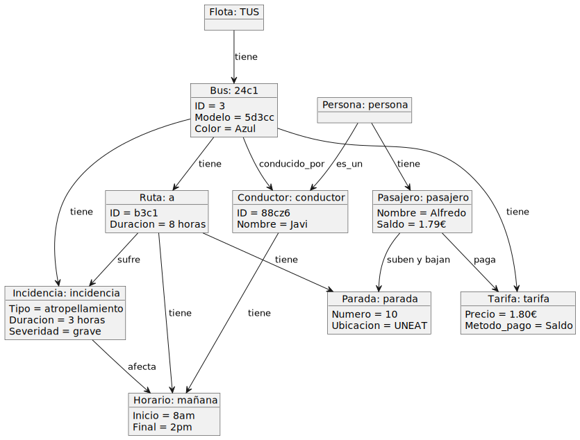
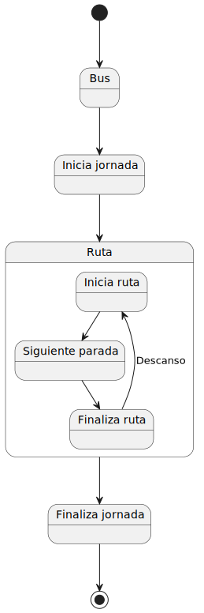

## Enlace al documento del examen original
 [Documento del examen original](https://github.com/Ingenieria-Informatica-UNEATLANTICO/app-actividad-post-parcial-JoseSalceda/blob/main/documents/parcial-joseSalceda.pdf)

 # Examen Original

 ### [Diagrama de Clases](https://github.com/Ingenieria-Informatica-UNEATLANTICO/app-actividad-post-parcial-JoseSalceda/blob/main/modelosUML/DiagramasExamen/DdC.puml) 
 
 

  ### [Diagrama de Objetos](https://github.com/Ingenieria-Informatica-UNEATLANTICO/app-actividad-post-parcial-JoseSalceda/blob/main/modelosUML/DiagramasExamen/DdC.puml) 
 
 

  ### [Diagrama de Estados](https://github.com/Ingenieria-Informatica-UNEATLANTICO/app-actividad-post-parcial-JoseSalceda/blob/main/modelosUML/DiagramasExamen/DdC.puml) 
 
 